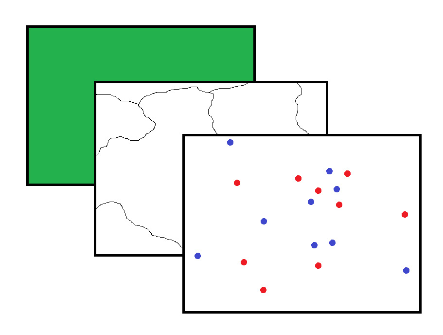

```{r setup, include=FALSE}
knitr::opts_chunk$set(echo = TRUE, fig.width=8.5)
```


***


***

# Intro

## Basic approach

We're going to use R and Leaflet (a Javascript library) to plot schools on a very simple map and show the boundaries of local authority districts. We're going to colour arbitrarily some of the LADs based on a particular condition and also alter the icon and colour of the markers according to Ofsted result, again arbitrarily.

We're going to:

1. Read Local Authority District (LAD) polygon data (boundaries) and subset for England
2. Read Schools data (points)
3. Build a map with these components

Note that the code and the data is arbitrary and for training purposes only. This is intended purely as an introduction; there are probably better ways to do the things I've laid out below, but this should help give you the gist. See the *Going Further* and *Resources* sections for more detail on how to do these things and find some further examples. 

## Setup

I recommend setting up your project as an [RStudio project](https://support.rstudio.com/hc/en-us/articles/200526207-Using-Projects) for easy reproducibility and transferability. Ask if you want more information about this.

We're going to make heavy use of the `dplyr` package for manipulation of our data and our maps. Remember when installing a package, you can use the`install.packages()` function to download it to your local library (a folder on your machine). You then only need to call the package from the library in future with the `library()` function.

```{r dplyr, message=FALSE, warning=FALSE}
library(dplyr)  # data manipulation and pipe operator (%>%)
```

Note also that I'm using the `::` notation in the code below to show detail the `package::function()` relationship.

***

# Local authority boundaries

## Collect the data

Local authority district (LAD) polygon data is available from the ONS [Open Geography Portal](https://www.ons.gov.uk/methodology/geography/geographicalproducts/opengeography). We're going to download a file of simplified LAD polygons from the URL using the [Application Programming Interface](https://medium.freecodecamp.org/what-is-an-api-in-english-please-b880a3214a82) (API) provided by ONS.

We're downloading it as a [GeoJSON](https://en.wikipedia.org/wiki/GeoJSON) file. This is a an open file type that is capable of holding geographical information and associated data, such as points, lines and polygons. The structure of a GeoJSON is nested and therefore differs from the 'flat' tables of a CSV file, for example.

```{r get_json, message=FALSE, warning=FALSE}
# set the URL from where the file can be collected
geojson_url <- "https://opendata.arcgis.com/datasets/ae90afc385c04d869bc8cf8890bd1bcd_4.geojson"

# set the file path where we'll download to
file_path <- "data/regions.geojson"

# download from the URL to the filepath specified
download.file(geojson_url, file_path)
```

Now we can read the GeoJSON file into our environment. 

```{r read_geojson}
lads <- geojsonio::geojson_read(
  x = file_path,  # the same file_path as above
  what = "sp"  # returns the read with spatial class
)
```

## Manipulate the data

### Spatial Polygons Data Frame

The GeoJSON is read as a special type of dataframe called a Spatial *Polygons* Data Frame (SPDF). An SPDF has special 'slots' for storing information. This includes a slot for co-ordinate data and a slot for the variables associated with those points. (Note that there's also Spatial *Points* Data Frame that we'll be dealing with later).

```{r glimpse_lads}
dplyr::glimpse(lads)
```

The SPDF is nested so that the data (i.e. a data frame, a list, a vector) are stored in 'slots'. You can see in the output above that the slots start with `@` and then the items therein can (in general) be called with `$` or `[]` notation. SO the structure of our SPDF looks like:

* `lads` -- our spatial polygons data frame
    * `@data` -- slot for variables associated with each of our polygons
        * `$objectid`  -- a variable with a unique object identification
        * `$lad17cd`  -- a variable with a unique local authority code
        * etc  -- other variables 
    * `@polygons` -- slot for defining polygon shape for each local authority
        * `$`[first polygon] -- the polygons themselves are nested
        * `$`[second polygon]  -- there's as many polygons as there are LADS
        * etc
    * `@plotOrder` -- slot for the order in which the polygons are placed on the map
    * `@bbox` -- slot for the 'bounding box', i.e. the extent of the map
    * `@proj4string` -- slot for the projection system used

To further investigate this, you can click the magnifying glass in the environment pane, to the right of the SPDF name:


This will open a tab in the scripting pane:


You can click the blue arrows to show the levels of nesting. Note that the polygons in the `@polygons` slot are themselves nested quite deeply. A SPDF helps keep all this complex infomration in one object. 


### England only

We know which of the LADs are in England because their LAD code (`ladcd17`) starts with 'E' ('W' and 'S' for Wales and Scotland, surprise surprise). There are 326 LADs in England, so the resulting SPDF should be that long, having been reduced from 380 (the number of LADs in Brit). We can access information using `@` to specify the slot and `$` to specify the variable.

```{r}
lads_eng <- subset(
  x = lads,  # our data
  subset = grepl(  # subset the data where the following pattern is matched
    x = lads@data$lad17cd,  # in this variable in this slot of this SPDF
    pattern = "^E"  # subset anything starting with 'E'
  )
)

length(lads_eng@data$lad17cd)  # check that the number of LADs is reduced
```

Success. We now have only the LADs in England.

***

# Schools

## Collect the data

We start with the data for the schools that you want to map. At very least this would have to be a list of school Unique Reference Numbers (URNs) or Local Authority Establishment Numbers (LAESTABs). We can then join school infomration from [Get Information About Schools](https://www.get-information-schools.service.gov.uk/) (GIAS), including co-ordinates in the form of eastings and northings.

For this demo, I sampled randomly 500 primary schools and 500 secondaries from the GIAS dataset and selected a few columns of interest. I saved the resulting dataframe object as an RDS file, so we can use the `readRDS()` to read the data into our environment.

```{r readRDS}
schools <- readRDS(file = "data/gias_sample.RDS")
```

Here's what the dataframe structure looks like:

```{r glimpse}
dplyr::glimpse(schools)
```

The column names are pretty self-explanatory. Note that the dataset is tidy -- one school per row -- and that we have unique identifiers (`urn` and `laestab`) and co-ordinates (`easting` and `northing`).

Sometimes co-ordinates can't be matched to schools from GIAS. We can check for any schools that are missing eastings and northings using `filter()` and `is.na()`. In our case, we have one set of co-ordinates missing for a secondary school:

```{r is.na}
schools %>%
  dplyr::filter(is.na(easting) | is.na(northing))
```

So let's create a new data frame object with complete co-ordinates information and check we have one fewer secondary school:

```{r schools_nona}
schools_nona <- schools %>%
  dplyr::filter(!is.na(easting) | !is.na(northing))

table(schools_nona$phase)
```

## Convert to latitude and longitude

There are many co-ordinate systems in use. The eastings and northings in GIAS are based on the system called the [British National Grid](https://en.wikipedia.org/wiki/Ordnance_Survey_National_Grid) (BNG). We'll reproject our BNG data to latitude and longitude because it's easier to handle in Leaflet and is the system used for our local authority district layer anyway.

To do this, [I'm using some code developed by Alex Singleton](http://www.alex-singleton.com/R-Tutorial-Materials/7-converting-coordinates.pdf), a Professor of Geographic Infomration Science at the University of Liverpool.

First we'll load the relevant packages:

```{r spatial_packages, message=FALSE, warning=FALSE}
library(rgdal)  #  Geospatial Data Abstraction Library functions
library(geojsonio)  # deal with json file
library(sp)  # deal with spatial data
```

Let's isolate the co-ordinate columns into a single dataframe object. I'm going to pre-emptively change the names of these columns to `longitude` and `latitude`, *but note that they haven't yet been converted*; they're still in the BNG projection.

```{r schools_coords}
schools_coords <- schools_nona %>%
  dplyr::transmute(  # create new columns and drop all the others
    easting = as.numeric(as.character(easting)), # make this text column numeric
    northing = as.numeric(as.character(northing))
  ) %>% 
  dplyr::rename(longitude = easting, latitude = northing)  # rename

print(schools_coords)
```

And we'll isolate the data columns as well.

```{r schools_data}
schools_data <- schools_nona %>%
  dplyr::select(-easting, -northing)  # select all columns except the coords

print(schools_data)
```

And now we'll merge these together into a Spatial *Points* Data Frane (we saw the *polygon* version of this when we read in the GeoJSON file of LADs earlier in this document).

```{r spdf}
schools_spdf <- sp::SpatialPointsDataFrame(  # create a SPDF
  coords = schools_coords,  # the school co-ordinates
  data = schools_data,  # the school data
  proj4string = CRS("+init=epsg:27700")  # BNG projection system
) %>% 
  sp::spTransform(CRS("+init=epsg:4326")) # reproject to latlong system
```

Here's what the structure of our SPDF looks like:

```{r glimpse_schools_spdf}
dplyr::glimpse(schools_spdf)
```

As before, note the slots are preceded by an `@` symbol. If you want to access the `phase` column for example, you would need to type `schools_spdf@data$phase`. Compare this to `schools$phase`, which you'd use to access the phase data in the original data frame.

***

# Create maps

Now we can bring the LAD polygons and the schools data together into a simple map using the `leaflet` package. This package wraps up some functions from the [Leaflet JavaScript library](http://leafletjs.com/).

Much of this material below is derived from the [Leaflet for R](https://rstudio.github.io/leaflet/) page from the RStudio team.

First we'll call the package from our library.

```{r package_leaflet}
library(leaflet)  # leaflet mapping functions
```

Leaflet maps are built up in layers. Our approach is going to be to do the following:

1. Add a basemap (the underlying map that contains geographic features)
2. Add our polygons (boundaries of LADs)
3. Add our markers (points where our sampled schools exist)

Here is an artist's rendering of layers, with the map at back, then boundaries (polygons) overlaid and finally the points:



Using pipe (`%>%`) notation, we can build these layers up one-by-one. This is much like building a ggplot object by building up layers using the `+`.

## Underlying map

Generating the underlying map is easy. We can choose a variety of background maps from [a number of providers](http://leaflet-extras.github.io/leaflet-providers/preview/), but Open Street Map is a good place to start. 

```{r map}
map <- leaflet::leaflet() %>%
  leaflet::addProviderTiles(providers$OpenStreetMap)

map  # show the map
```

Now we'll add a layer containing the LAD polygons.

## LAD polygons

To show the boundaries, we could simply render the edges and leave the area of the polygon clear. We could also pick out individual LADs based on some variable. Arbitrarily, let's fill any that are over a certain area, given by the `st_areashape` variable in the GeoJSON file. We can do this using an `ifelse()` statement for the `fillOpacity` argument in the `addPolygons()` function.

```{r lad_poly}
map_lad <- map %>%
  leaflet::addPolygons(
    data = lads_eng,  # LAD polygon data from geojson
    weight = 1,  # line thickness
    opacity = 1,  # line transparency
    color = "black",  # line colour
    fillOpacity = ifelse(  # conditional fill opacity
      test = lads_eng@data$st_areashape > 1E+09,  # if area is over this value
      yes = 0.5,  # then make it half-opaque
      no = 0  # otherwise make it entirely transparent
    ),
    fillColor = "red",
    label = ~lad17nm  # LAD name as a hover label
  )

map_lad  # show the map
```

Hover over the polygons in the map above to see the name of the LAD.

## Marker points

So now we'll add some markers that show where are schools are. Rather than mark all the points with exactly the same marker, we're going to colour the markers according got Ofsted rating and give them icons that relate to their educaiton phase.

 What levels of Ofsted rating do we have?

```{r subset}
table(schools_spdf@data$ofsted_rating)
```

So let's colour differently three separate groups:

* 'Outstanding'
* 'Good'
* everything elese ('Inadequate', 'Requires improvement', 'Serious Weaknesses' and 'Special Measures').

We're going to use the `addAwesomeMarkers()` function rather than the `addMarkers()` function. This is because it's more... *awesome*. It allows you to tweak a lot of settings with your markers. For example, you can use the `awesomeIcons()` function in the `icon` argument to select from a range of different icons. By specifying the library, you can name an icon and it will automatically be used. In this example, we're using the 'ion' library and the icons named 'ion-arrow-*-b'. You can preview the icons available in the 'ion' library by visitng the [ionicons website](http://ionicons.com/). You need only to replace the `icon` argument in the `awesomeIcons()` function with the name of any of the icons shown on the website (click the icon for its name).

```{r}
map_groups <- map_lad %>% 
  leaflet::addAwesomeMarkers(
    data = schools_spdf,  # our spatial points data frame
    icon = awesomeIcons(
      library = "ion",
      icon = ifelse(
        test = schools_spdf@data$ofsted_rating == "Primary",
        yes = "ion-arrow-down-b",  # down arrow for primary
        no = "ion-arrow-up-b"  # up arrow for secondary
      ),
      iconColor = "white",  # the icon's colour
      markerColor = ifelse(
        test = schools_spdf@data$ofsted_rating == "Outstanding",  # if this...
        yes = "blue",  # ...then colour blue
        no = ifelse(
          test = schools_spdf@data$ofsted_rating == "Good",  # if this...
          yes = "lightblue",  # ...then colour lightblue
          no = "red"  # colour remaining schools (Ofsted rating RI, I, SW or SM)
            )
          )
        )
      )
    
map_groups  # show the map
```

This is better than plain markers that are the same for all schools, but it's difficult to see what's going on. We can instead introduce the concept of 'groups' that can be toggled on or off.

## Toggle groups


### Subset data

We're going to do something similar to the map above, but each group of markers will be added separately with its own call to the `addAwesomeMarkers()` function.

First we need to subset the data into our categories of interest.

```{r}
# Outstanding
ofsted_outst <- subset(
  x = schools_spdf,
  subset = schools_spdf@data$ofsted_rating == "Outstanding"
)

# Good
ofsted_good <- subset(
  x = schools_spdf,
  subset = schools_spdf@data$ofsted_rating == "Good"
)

# The others
ofsted_other <- subset(
  x = schools_spdf,
  subset = schools_spdf@data$ofsted_rating %in% c(
    "Requires Improvement", "Inadequate",
    "Serious Weaknesses", "Special Measures"
  )
)
```

### Function: popups

While we're here, we're also going to add a function that will populate the on-click marker popups with detail about that individual school. Words in quotes will be rendered verbatim and personalised content will fill the popup where we've specified data from the `@data` slot of our SPDF. Note that we can use HTML in here too: `<br>` inserts a line break.

```{r}
get_popup_content <- function(ofsted_group_spdf) {
  paste0(
    "<b>", ofsted_group_spdf@data$sch_name, "</b>",
    "<br>LAESTAB: ", ofsted_group_spdf@data$laestab,
    "<br>",
    "<br>Phase: ", ofsted_group_spdf@data$phase,
    "<br>Ofsted: ", ofsted_group_spdf@data$ofsted_rating,
    "<br>Pupils: ", ofsted_group_spdf@data$pupil_count, " (2017)"
  )
}
```

### Function: add markers

And now we'll create a function for adding the markers. Note that the `get_popup_content()` function we defined above is used here in the popup argument to `addAwesomeMarkers()`

```{r}
assign_markers <- function(
  map_object,
  ofsted_group_spdf,
  group_name,
  marker_col = "blue"  # will default to blue
) {
  
  leaflet::addAwesomeMarkers(
    map = map_object,  # the base map we created first
    data = ofsted_group_spdf,  # the spatial points data frame
    group =  group_name,  # the name for the marker grouping
    popup = ~get_popup_content(ofsted_group_spdf),  # our popup function
    icon = awesomeIcons(
      library = "ion",  # the ion set of icons
      icon = ifelse(  # conditional icon
        test = ofsted_group_spdf@data$phase == "Primary",
        yes = "ion-arrow-down-b",  # primary gets a down arrow
        no = "ion-arrow-up-b"  # up arrows for secondary schools
      ),
      iconColor = "white",
      markerColor = marker_col  # you can specify a colout for the marker 
    )
  )  
}
```

### Map

Now put it together. See how using out `assign_marker()` function -- with the `get_popup_content()` function inside -- helps cut down the code and make it more readable.

The 'Oustatnding' group are turned on by default and the other two are off. You can switch them on using the checkboxes in the top right. Note that the more markers that are showing, the slower it is to respond to your interactions.

```{r}
map_toggle <- map_lad %>% 
  # add the markers (order is the order the checkboxes will appear on the map)
  assign_markers(  # marker group 1: 'outstanding' schools
    ofsted_group_spdf = ofsted_outst,  # the subset we specified earlier
    group_name = "Outstanding"  # sensible group name
  ) %>% 
  assign_markers(  # marker group 2: 'good' schools
    ofsted_group_spdf = ofsted_good,   # the subset we specified earlier
    group_name = "Good",  # sensible group name
    marker_col = "lightblue"
  ) %>% 
  assign_markers(  # marker group 3: schools performing worse than 'good'
    ofsted_group_spdf = ofsted_other,  # the subset we specified earlier
    group_name = "Other",  # sensible group name
    marker_col = "red"
  ) %>% 
  # controlling the groups
  leaflet::addLayersControl(
    overlayGroups = c("Outstanding", "Good", "Other"),  # add these layers
    options = layersControlOptions(collapsed = FALSE)  # expand on hover?
  ) %>% 
  hideGroup(c("Good", "Other"))  # turn these off by default
    
map_toggle  # show the map
```

The 'good' layer is still a bit busy, but we can remedy that.

### Clusters

We can automatically group nearby markers into *clusters*, shown as coloured circles on the map. The number on the circle indicates the number of markers grouped together into that circle' (see image below); higher numbers make the circle red, lower numbers make it green. Hovering over the circle shows you the extent of the markers demarcated with a displaying a blue boundary. As you zoom in, the clusters expand into smaller clusters and ultimately into individual markers.


I've turned on the 'Good' group by default to make the clusters obvious. I've also built the points layer directly on top of the base map without the local authority boundaries, again for ease of understanding.

```{r}
map_clusters <- map %>% 
  # add the markers (order is the order the checkboxes will appear on the map)
  assign_markers(  # use our function for adding markers
    ofsted_group_spdf = ofsted_outst,
    group_name = "Outstanding"
  ) %>%
  leaflet::addAwesomeMarkers(  # using addAwesomeMarkers function so you can...
    data = ofsted_good,
    clusterOptions = markerClusterOptions(),  # ...see how clusters are added
    group =  "Good",
    popup = ~get_popup_content(ofsted_good),
    icon = awesomeIcons(
      library = "ion",
      icon = ifelse(
        test = ofsted_good@data$phase == "Primary",
        yes = "ion-arrow-down-b",
        no = "ion-arrow-up-b"
      ),
      iconColor = "white",
      markerColor = "lightblue"
    )
  ) %>%
  assign_markers(  # use our function for adding markers
    ofsted_group_spdf = ofsted_other,
    group_name = "Other",
    marker_col = "red"
  ) %>% 
  # controlling the groups
  leaflet::addLayersControl(
    overlayGroups = c("Outstanding", "Good", "Other"),  # add these layers
    options = layersControlOptions(collapsed = FALSE)  # expand on hover?
  ) %>% 
  hideGroup(c("Outstanding", "Other"))  # turn these off by default
    
map_clusters # show the map
```

***

# Going further

You can:

* embed this in an R Shiny interface and have reactive elements (e.g. zoom to a LAD)
* embed these maps in an HTML for sharing (like this one)
* make a choropleth map by colouring your polygons on a continuous scale
* change the marker style, not just the icon
* plot shapes, e.g. circles of fixed radius from a point of origin

And much more.

***

# Resources

* [Leaflet homepage](http://leafletjs.com/)
* [Leaflet for R](https://rstudio.github.io/leaflet/)
* [ONS Open Geography Portal](http://geoportal.statistics.gov.uk/)
* [Get Information About Schools](https://get-information-schools.service.gov.uk/)
* [RStudio cheat sheets](https://www.rstudio.com/resources/cheatsheets/)
* [Leaflet embedded in R Shiny example](https://shiny.rstudio.com/gallery/superzip-example.html)